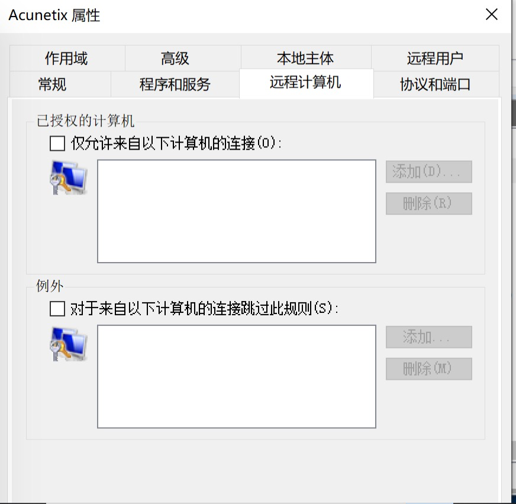

# awvs12-api
> `Acunetix Web Vulnerability Scanner`（简称`AWVS`）是一款知名的网络漏洞扫描工具，它提供了主动扫描web的功能，可以扫描出一些常见的的web漏洞，是渗透测试分析的好帮手。此`Repo`为`AWVS`的非官方接口，主要获取方式是靠抓包分析得到。注: 此`repo`使用的是`AWVS12`。

### 如何使用
> 在学习`AWVS API`之前，读者需要具有`AWVS`的基本使用经验，了解`AWVS`基本使用流程。

在`API`目录下存放的是与`AWVS`使用相关的类，包括：
1. Base.py
2. Dashboard.py
3. Group.py
4. Report.py
5. Scan.py
6. Target.py
7. TargetOption.py
8. Vuln.py

在`config`目录下存放的是与配置相关的脚本，包括但不仅限于`logger`配置。在根目录下,`test_awvs.py`用于测试`API`目录下的类和方法。

使用环境：
|工具|版本|
|--|--|
|python|3.7|
|pipenv|--|

使用方式：
```python
pipenv shell
pipenv install
```

### `API`说明
#### 扫描相关操作
##### `Target`相关操作
1. 添加
    1. API
    ```python
    {api_base_url}/api/v1/targets
    ```
    2. method
    ```python
    POST
    ```
    3. request payload
    ```python
        {
            'address': address,
            'description': description,
        }
    ```
2. 删除
    1. API
    ```python
    {api_base_url}/api/v1/targets/{target_id}
    ```
    2. method
    ```python
    DELETE
    ```
    3. request payload
    无

3. 获取所有`target_id`
    1. API
    ```python
    {api_base_url}/api/v1/targets
    ```
    2. method
    ```python
    GET
    ```
    3. 获取返回`json`中的`targets`字段

4. 搜索

待完善

##### `Scan`相关操作
1. 各种扫描对应的参数
扫描类型：
```python
    'full_scan': '11111111-1111-1111-1111-111111111111',
    'high_risk_vuln': '11111111-1111-1111-1111-111111111112',
    'xss_vuln': '11111111-1111-1111-1111-111111111116',
    'sqli_vuln': '11111111-1111-1111-1111-111111111113',
    'weak_passwords': '11111111-1111-1111-1111-111111111115',
    'crawl_only': '11111111-1111-1111-1111-111111111117'
```
扫描时间类型：
```python
1. 定时扫描，time senstive为False
schedule = {disable: False, start_date: "20180816T000000+0700", time_sensitive: False}
2. 定时扫描，time senstive为True
schedule = {disable: False, start_date: "20180816T000000+0700", time_sensitive: True}
3.周期扫描，每天
schedule = {disable: false, recurrence: "DTSTART:20180815T170000Z FREQ=DAILY;INTERVAL=1", time_sensitive: false}
4.周期扫描，每周
schedule = {disable: false, recurrence: "DTSTART:20180815T170000Z FREQ=WEEKLY;INTERVAL=1", time_sensitive: false}
5.周期扫描，每月
schedule = {disable: false, recurrence: "DTSTART:20180815T170000Z FREQ=MONTHLY;INTERVAL=1", time_sensitive: false}
6.周期扫描，每年
schedule = {disable: false, recurrence: "DTSTART:20180815T170000Z FREQ=YEARLY;INTERVAL=1", time_sensitive: false}
7.自定义
修改FREQ和INTERVAL即可
(1)无截止时间格式
schedule = {disable: false, recurrence: "DTSTART:20180815T170000Z FREQ=YEARLY;INTERVAL=1", time_sensitive: false}
(2)有截止时间
schedule = {disable: false, recurrence: "DTSTART:20180815T170000Z FREQ=YEARLY;INTERVAL=1;UNTIL=20180830T170000Z", time_sensitive: false}
```
上面的参数需要在AWVS12中进一步认证

2. 添加扫描
    1. API
    ```python
    {api_base_url}/api/v1/scans
    ```
    2. method
    ```python
    POST
    ```
    3. request payload
    ```python
    { 
        'target_id': target_id,
        'profile_id': 扫描类型,
        'report_template_id': 结果文档类型,
        'schedule': 扫描时间类型
    }
    ```
3. 删除扫描
    1. API
    ```python
    {api_base_url}/api/v1/scans
    ```
    2. method
    ```python
    DELETE
    ```
    3. request payload
    无
4. 获取扫描结果
    1. API
    ```python
    {api_base_url}/api/v1/scans
    ```
    2. method
    ```python
    GET
    ```
    3. 获取返回JSON中scans字段

5. 获取
##### `Group`相关操作
1. 创建组
    1. API
    ```shell
    /api/v1/target_groups
    ```
    2. method
    ```shell
    POST
    ```
    3. request payload
    ```shell
    {"name":"test","description":""}
    ```
2. 将指定`target`添加到组内
    1. API
    ```shell
    /api/v1/target_groups/{指定模式的group_id}/targets
    ```
    2. method
    ```shell
    PATCH
    ```
    3. request payload
    ```shell
    {"add":[target_id],"remove":[]}
    ```
3. 将指定`target`从组内删除
    1. API
    ```shell
    /api/v1/target_groups/{指定模式的group_id}/targets
    ```
    2. method
    ```shell
    PATCH
    ```
    3. request payload
    ```shell
    {"add":[],"remove":[target_id]}
    ```
#### 结果显示相关

#### 权限配置相关

由于`awvs`安装完成以后，会提供一个可供外网访问的 `web`服务，这就是说，为了安全性必须对能够访问 `awvs`的IP进行限制。下面将说明如何对 `awvs`服务器进行配置。

1. 打开控制面板
2. 选择`windows firewall defender`
3. 选择高级设置
4. 选择入站规则
5. 双击Acunetix图标
6. 选择远程计算机栏
7. 

在已授权的计算机处填入允许访问的IP即可。